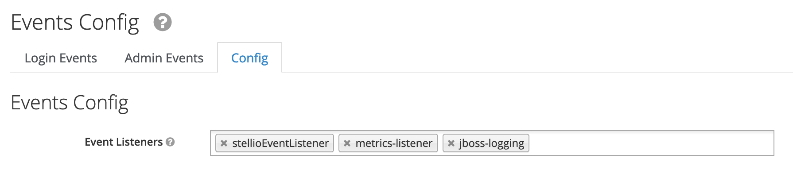

# Keycloak integration

Stellio can be used with the [Keycloak](https://www.keycloak.org) IAM solution.

Installation and configuration of Keycloak is not described here, as it is well documented on the Keycloak site.

In order to connect Stellio with Keycloak, the following steps have to be performed:
- Use the Keycloak Docker image provided by EGM (https://hub.docker.com/repository/docker/easyglobalmarket/keycloak)
- Create a realm in Keycloak (if not yet existing)
- Create the builtin roles known and used by Stellio
- Configure Keycloak to propagate user, group and client events to Stellio
- Activate and configure authentication in Stellio

## Use the Keycloak Docker image by EGM

This Docker image extends the Keycloak Docker image to bundle into it two SPIs:
- The Stellio event listener that propagates provisioning events to the Kafka message broker used by Stellio
- A metrics listener that exposes an endpoint that can be consumed by Prometheus

## Create a realm

Follow instructions here on how to create a new realm in Keycloak: https://www.keycloak.org/docs/latest/server_admin/index.html#_create-realm

## Create the builtin roles

Stellio natively interprets two specific Realm roles that must first be created in Keycloak: see here https://www.keycloak.org/docs/latest/server_admin/index.html#realm-roles for the procedure:
- `stellio-creator`: it gives an user the right to create entities in the context broker
- `stellio-admin`: it gives an user the administrator rights in the context broker



## Configure Keycloak event listener

In the Keycloak Docker configuration, add the Kafka environment variables:

```yaml
  keycloak:
    container_name: keycloak
    image: easyglobalmarket/keycloak
    environment:
      - KAFKA_BOOTSTRAP_SERVERS={realm_name}/{kafka_ip}:{kafka_port}
      - KAFKA_KEY_SERIALIZER_CLASS=org.apache.kafka.common.serialization.StringSerializer
      - KAFKA_VALUE_SERIALIZER_CLASS=org.apache.kafka.common.serialization.StringSerializer
      - KAFKA_ACKS=all
      - KAFKA_DELIVERY_TIMEOUT_MS=3000
      - KAFKA_REQUEST_TIMEOUT_MS=2000
      - KAFKA_LINGER_MS=1
      - KAFKA_BATCH_SIZE=16384
      - KAFKA_BUFFER_MEMORY=33554432
```

Please note that for a more secure deployment, it is recommended to setup a certficate based authentication between Keycloak and Kafka.

Then, in the Keycloak admin console:
- Select the realm that will be used by Stellio
- Go to the Events section
- Switch to the Config tab and add stellioEventListener in the list of events listeners.


## Configure authentication in Stellio

Finally, on Stellio side, configure the Keycloak URLs in entity, search and subscription services.

For instance:

```yaml
  entity-service:
    environment:
      - SPRING_SECURITY_OAUTH2_RESOURCESERVER_JWT_ISSUER-URI=${SPRING_SECURITY_OAUTH2_RESOURCESERVER_JWT_ISSUER_URI}
      - SPRING_SECURITY_OAUTH2_RESOURCESERVER_JWT_JWK-SET-URI=${SPRING_SECURITY_OAUTH2_RESOURCESERVER_JWT_JWK_SET_URI}
```

Values should look like:
- https://sso.yourcompany.com/auth/realms/{realm_name}
- https://sso.yourcompany.com/auth/realms/{realm_name}/protocol/openid-connect/certs
