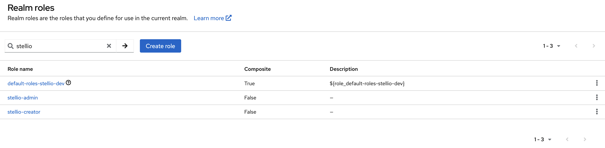
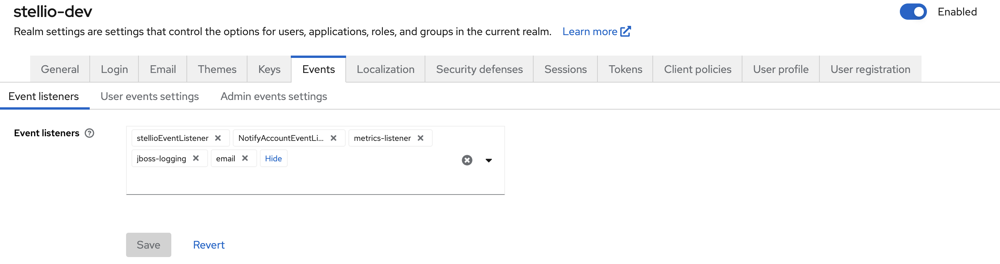

# Keycloak integration

Stellio can be used with the [Keycloak](https://www.keycloak.org) IAM solution.

## Connect Keycloak with Stellio

Installation and configuration of Keycloak is not described here, as it is well documented on the Keycloak site.

In order to connect Stellio with Keycloak, the following steps have to be performed:

- Use the [Keycloak Docker image provided by EGM](https://hub.docker.com/repository/docker/easyglobalmarket/keycloak)
- Create a realm in Keycloak (if not yet existing)
- Create the builtin roles known and used by Stellio
- Configure Keycloak to propagate user, group and client events to Stellio
- Activate and configure authentication in Stellio

### Use the Keycloak Docker image by EGM

The provoded Docker image extends the official Keycloak Docker image to bundle it with two SPIs:

- The Stellio event listener that propagates provisioning events to the Kafka message broker used by Stellio
- A metrics listener that exposes an endpoint that can be consumed by Prometheus

To start with, you can use this sample Docker compose file (do not forget to create a `.env` file with the needed environment variables):

```yaml
version: '3.5'
services:
  keycloak:
    container_name: keycloak
    image: easyglobalmarket/keycloak
    restart: always
    environment:
      - KEYCLOAK_USER=${KEYCLOAK_USER}
      - KEYCLOAK_PASSWORD=${KEYCLOAK_PASSWORD}
      - PROXY_ADDRESS_FORWARDING=true
      - DB_VENDOR=postgres
      - DB_ADDR=postgres
      - DB_DATABASE=${KEYCLOAK_DB_DATABASE}
      - DB_USER=${KEYCLOAK_DB_USER}
      - DB_PASSWORD=${KEYCLOAK_DB_PASSWORD}
      - KAFKA_BOOTSTRAP_SERVERS={realm_name}/{kafka_ip}:{kafka_port}
      - KAFKA_KEY_SERIALIZER_CLASS=org.apache.kafka.common.serialization.StringSerializer
      - KAFKA_VALUE_SERIALIZER_CLASS=org.apache.kafka.common.serialization.StringSerializer
      - KAFKA_ACKS=all
      - KAFKA_DELIVERY_TIMEOUT_MS=3000
      - KAFKA_REQUEST_TIMEOUT_MS=2000
      - KAFKA_LINGER_MS=1
      - KAFKA_BATCH_SIZE=16384
      - KAFKA_BUFFER_MEMORY=33554432
    ports:
      - 9990:8080
    depends_on:
      - postgres
  postgres:
    container_name: postgres
    image: postgres:12-alpine
    restart: always
    volumes:
      - postgres_data:/var/lib/postgresql/data
    environment:
      POSTGRES_DB: ${KEYCLOAK_DB_DATABASE}
      POSTGRES_USER: ${KEYCLOAK_DB_USER}
      POSTGRES_PASSWORD: ${KEYCLOAK_DB_PASSWORD}

volumes:
  postgres_data:
      driver: local
```

where:

- `realm_name` is the name of the realm to be created in the next section
- `kafka_ip` and `kafka_port` is the address where the Stellio's Kafka instance is running

Please note that for a more secure deployment, it is recommended to setup a certficate based authentication between Keycloak and Kafka.

### Create a realm

Follow instructions on how to [create a new realm in Keycloak](https://www.keycloak.org/docs/latest/server_admin/index.html#_create-realm)

### Create the builtin roles

Stellio natively interprets two specific Realm roles that must first be created in Keycloak (see [procedure to create a role](https://www.keycloak.org/docs/latest/server_admin/index.html#realm-roles):

- `stellio-creator`: it gives an user the right to create entities in the context broker
- `stellio-admin`: it gives an user the administrator rights in the context broker



### Configure Keycloak event listener

In the Keycloak admin console:

- Select the realm that will be used by Stellio
- Go to the Events section
- Switch to the Config tab and add stellioEventListener in the list of events listeners.



### Configure authentication in Stellio

Finally, on Stellio side, configure the Keycloak URLs in entity, search and subscription services in Docker compose config.

For instance:

```yaml
  entity-service:
    environment:
      - SPRING_SECURITY_OAUTH2_RESOURCESERVER_JWT_ISSUER-URI=${SPRING_SECURITY_OAUTH2_RESOURCESERVER_JWT_ISSUER_URI}
      - SPRING_SECURITY_OAUTH2_RESOURCESERVER_JWT_JWK-SET-URI=${SPRING_SECURITY_OAUTH2_RESOURCESERVER_JWT_JWK_SET_URI}
```

Values should look like:

- https://sso.yourcompany.com/auth/realms/{realm_name}
- https://sso.yourcompany.com/auth/realms/{realm_name}/protocol/openid-connect/certs

## Events raised by Keycloak

While creating and configuring users, groups and clients in Keycloak, the following events are raised by Keycloak and sent to the Kafka message broker operated by Stellio:

- Create an user

```json
{
  "operationType":"ENTITY_CREATE",
  "entityId":"urn:ngsi-ld:User:aaaaaaaa-bbbb-cccc-dddd-eeeeeeeeeeee",
  "entityType":"User",
  "operationPayload":"{\"id\":\"urn:ngsi-ld:User:aaaaaaaa-bbbb-cccc-dddd-eeeeeeeeeeee\",\"type\":\"User\",\"username\":{\"type\":\"Property\",\"value\":\"user@mail.com\"},\"roles\":{\"type\":\"Property\",\"value\":\"stellio-creator\"}}",
  "contexts":["https://raw.githubusercontent.com/easy-global-market/ngsild-api-data-models/master/authorization/jsonld-contexts/authorization.jsonld","https://uri.etsi.org/ngsi-ld/v1/ngsi-ld-core-context.jsonld"]
}
```

- Create a group

```json
{
  "operationType":"ENTITY_CREATE",
  "entityId":"urn:ngsi-ld:Group:zzzzzzzz-yyyy-xxxx-wwww-vvvvvvvvvvvv",
  "entityType":"Group",
  "operationPayload":"{\"id\":\"urn:ngsi-ld:Group:zzzzzzzz-yyyy-xxxx-wwww-vvvvvvvvvvvv\",\"type\":\"Group\",\"name\":{\"type\":\"Property\",\"value\":\"Group name\"}}",
  "contexts":["https://raw.githubusercontent.com/easy-global-market/ngsild-api-data-models/master/authorization/jsonld-contexts/authorization.jsonld","https://uri.etsi.org/ngsi-ld/v1/ngsi-ld-core-context.jsonld"]
}
```

- Create a client

```json
{
  "operationType":"ENTITY_CREATE",
  "entityId":"urn:ngsi-ld:Client:ffffffff-gggg-hhhh-iiii-jjjjjjjjjjjj",
  "entityType":"Client",
  "operationPayload":"{\"id\":\"urn:ngsi-ld:Client:ffffffff-gggg-hhhh-iiii-jjjjjjjjjjjj\",\"type\":\"Client\",\"clientId\":{\"type\":\"Property\",\"value\":\"client-id\"}}",
  "contexts":["https://raw.githubusercontent.com/easy-global-market/ngsild-api-data-models/master/authorization/jsonld-contexts/authorization.jsonld","https://uri.etsi.org/ngsi-ld/v1/ngsi-ld-core-context.jsonld"]
}
```

- Set the service account id of a client

It is the identifier that is transmitted when a client does a direct request on the context broker (i.e., not on behalf of an user). It is automatically transmitted when realm roles are given to a client.

```json
{
  "operationType":"ATTRIBUTE_APPEND",
  "entityId":"urn:ngsi-ld:Client:ffffffff-gggg-hhhh-iiii-jjjjjjjjjjjj",
  "entityType":"Client",
  "attributeName":"serviceAccountId",
  "operationPayload":"{\"type\":\"Property\",\"value\":\"urn:ngsi-ld:User:jjjjjjjj-iiii-hhhh-gggg-ffffffffffff\"}",
  "updatedEntity":"",
  "contexts":["https://raw.githubusercontent.com/easy-global-market/ngsild-api-data-models/master/authorization/jsonld-contexts/authorization.jsonld","https://uri.etsi.org/ngsi-ld/v1/ngsi-ld-core-context.jsonld"]
}
```

- Update realm roles of an user / group / client

An array of realm roles is sent, it is empty if the subject has no longer a realm role.

```json
{
  "operationType":"ATTRIBUTE_APPEND",
  "entityId":"urn:ngsi-ld:Client:ffffffff-gggg-hhhh-iiii-jjjjjjjjjjjj",
  "entityType":"Client",
  "attributeName":"roles",
  "operationPayload":"{\"type\":\"Property\",\"value\":[\"stellio-creator\"]}",
  "updatedEntity":"",
  "contexts":["https://raw.githubusercontent.com/easy-global-market/ngsild-api-data-models/master/authorization/jsonld-contexts/authorization.jsonld","https://uri.etsi.org/ngsi-ld/v1/ngsi-ld-core-context.jsonld"]
}
```

- Add an user to a group

```json
{
  "operationType":"ATTRIBUTE_APPEND",
  "entityId":"urn:ngsi-ld:User:aaaaaaaa-bbbb-cccc-dddd-eeeeeeeeeeee",
  "entityType":"User",
  "attributeName":"isMemberOf",
  "datasetId":"urn:ngsi-ld:Dataset:isMemberOf:zzzzzzzz-yyyy-xxxx-wwww-vvvvvvvvvvvv",
  "operationPayload":"{\"type\":\"Relationship\",\"object\":\"urn:ngsi-ld:Group:zzzzzzzz-yyyy-xxxx-wwww-vvvvvvvvvvvv\",\"datasetId\":\"urn:ngsi-ld:Dataset:isMemberOf:zzzzzzzz-yyyy-xxxx-wwww-vvvvvvvvvvvv\"}",
  "updatedEntity":"",
  "contexts":["https://raw.githubusercontent.com/easy-global-market/ngsild-api-data-models/master/authorization/jsonld-contexts/authorization.jsonld","https://uri.etsi.org/ngsi-ld/v1/ngsi-ld-core-context.jsonld"]
}
```

- Remove an user from a group

```json
{
  "operationType":"ATTRIBUTE_DELETE",
  "entityId":"urn:ngsi-ld:User:aaaaaaaa-bbbb-cccc-dddd-eeeeeeeeeeee",
  "entityType":"User",
  "attributeName":"isMemberOf",
  "datasetId":"urn:ngsi-ld:Dataset:isMemberOf:zzzzzzzz-yyyy-xxxx-wwww-vvvvvvvvvvvv",
  "updatedEntity":"",
  "contexts":["https://raw.githubusercontent.com/easy-global-market/ngsild-api-data-models/master/authorization/jsonld-contexts/authorization.jsonld","https://uri.etsi.org/ngsi-ld/v1/ngsi-ld-core-context.jsonld"]
}
```

- Update the name of a group

```json
{
  "operationType":"ATTRIBUTE_REPLACE",
  "entityId":"urn:ngsi-ld:Group:zzzzzzzz-yyyy-xxxx-wwww-vvvvvvvvvvvv",
  "entityType":"Group",
  "attributeName":"name",
  "operationPayload":"{\"type\":\"Property\",\"value\":\"New group name\"}",
  "updatedEntity":"",
  "contexts":["https://raw.githubusercontent.com/easy-global-market/ngsild-api-data-models/master/authorization/jsonld-contexts/authorization.jsonld","https://uri.etsi.org/ngsi-ld/v1/ngsi-ld-core-context.jsonld"]
}
```

- Delete a user / group / client

```json
{
  "operationType":"ENTITY_DELETE",
  "entityId":"urn:ngsi-ld:Group:zzzzzzzz-yyyy-xxxx-wwww-vvvvvvvvvvvv",
  "entityType":"Group",
  "contexts":["https://raw.githubusercontent.com/easy-global-market/ngsild-api-data-models/master/authorization/jsonld-contexts/authorization.jsonld","https://uri.etsi.org/ngsi-ld/v1/ngsi-ld-core-context.jsonld"]
}
```