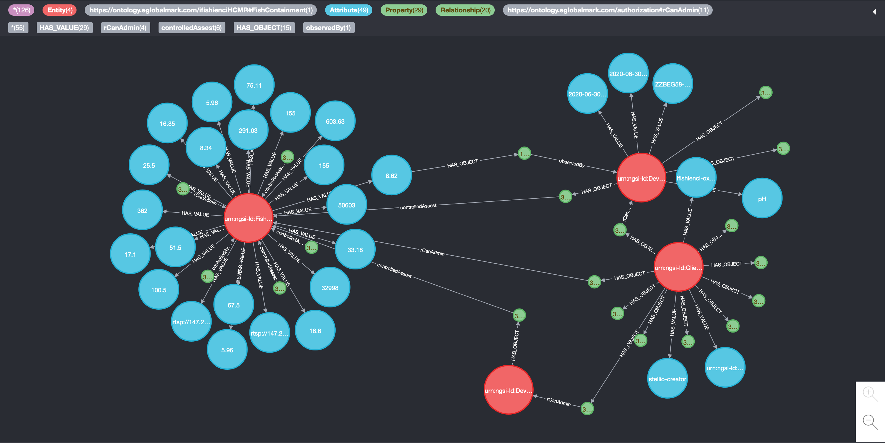

# Visualizing your graph

As all the context information is stored in the neo4j graph database, you can easily view it using the neo4j graph browser.

It is available at the following URL: http://{host_ip_address}:7474/browser.

Connect to it using the following settings:

- Connect URL: bolt://{host_ip_address}:7687
- Database: leave empty
- Authentication type: username / password
- Username: neo4j
- Password: password set in your environment

Then you can browse your entities, properties and relationships:

